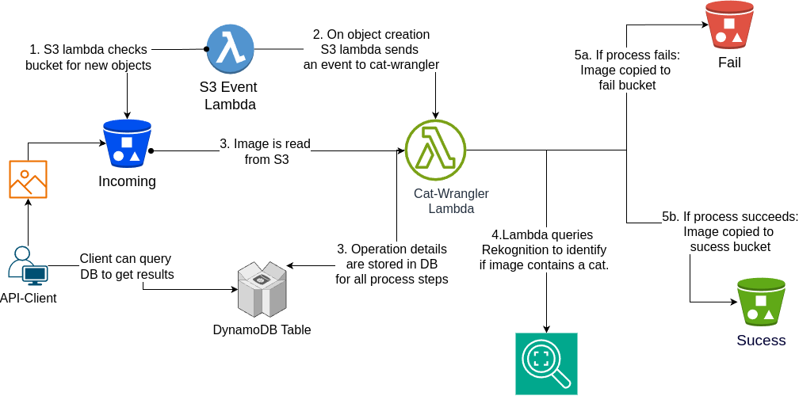
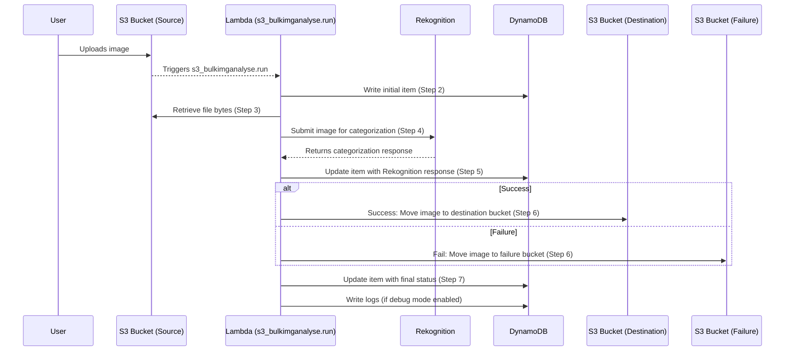

# ice-cat-wrangler - 2025 (A Timed Interview Test ~11 days)

## Context

In this task, we ask you to prepare a simple service that, for a given image file (JPEG/PNG), answers the question: **Does the image file contain the image of a cat?**

**Problem: Does the image file provided contain a cat?**

**Input:** Picture file (JPG/PNG)

**Output:** Yes or No

---

## Task Requirements

We need the following behaviors:

1. User can upload an image file for scanning.
2. User can only upload JPEG and PNG files.
3. The image is kept in persistent storage.
4. Scanning is a non-blocking operation.
5. User can check the result of image scanning.
6. Results are kept in persistent storage.
7. Debug data is available for a power user.
8. There is any kind of interface available to interact with the application.

---

## Extra Information

1. Only consider **AWS cloud** and AWS/Amazon services.
2. Build a **serverless application**.
3. Use any high-level programming language.
4. You are free to choose the build tools, libraries, etc.
5. Ensure that the code in the submission is fully functional and include instructions for building and running it.
6. You don't need to dedicate days to this; simply demonstrate your ability to craft excellent software.
7. Use this exercise as a guide for design decisions, considering it as the initial prototype of a Minimum Viable Product (MVP) that will evolve into a production-ready deliverable.
8. Be prepared for further discussions regarding how to transition and scale the prototype for future deployment.

---

# Solution Overview:

I've tried to write code that sets-up avenues whereby we can minimise cost whilst maximising performance. Obviously, this is an iterative process that will materialise results as the requirements crystalise.

The repository is divided into 4 major components:
1. **`infra-terra`:** Contains terraform code to create various AWS resources
2. **`serverless`:** Contains a lambda function that handles image processing
3. **`api_client`:** Contains an api_client that can upload images and get the categorisation results from uploaded files. Uses `rich` print instead of logs for a better user experience.
4. **`shared_helpers`:** Contains shared functions and classes that can be shared between `infra-terra` and serverless. I've tried to write the code to be easily abstracted to other use cases. That way it could potentially be split out into a separate repo so that other applications can also use this code.

The solution relies upon using both terraform and serverless as deployment agents because each tool has its strengths & weaknesses. Note the following reasons:

1. **Serverless**:
    - Ideal for deploying Lambdas and API Gateways.
    - `sls deploy` leverages easily definable configurations in the `serverless.yml` file.
    - Requires less code to deploy things such as an API Gateway compared to Terraform.
    - Resources are tightly coupled to application code changes which is helpful to developers.
    - Allows developers to deploy without requiring specialised DevOps knowledge.

#### Resources are shared between terraform and serverless using SSM variables. The api_client also leverages the same SSM variables to auto-configure env vars.

2. **Terraform**:
It is good to deploy more fundamental resources such as S3 buckets, iam policies, etc using terraform because:
    - It involves less code in some cases. (have you seen an IAM policy in `serverless.yml`?)
    - The terraform deployment role in most companies usually ends up getting more & more permissions added to it till it converges to administrator perms. Allowing many devs to have admin access is a security issue. Thus, things like IAM, route53, etc should be restricted.
    - As we would like to promote the app between identical dev --> uat --> prod stages, it would make sense to let devs create the app in a dev AWS account with admin perms. These perms would not be available in uat and prod AWS accounts.


For more details on the co-location method used here please see: [Terraform & Serverless Co-location Demo](https://github.com/stablecaps/terraform_and_serverless_demo)

The article also discusses other aspects such as how to best organise terraform repos, etc.

## Infrastructure Overview

[](docs/infrastructure.drawio.png)

The `ice-cat-wrangler` application consists of the following AWS infrastructure components:

### 1. **S3 Buckets**
- **Source Bucket**: Stores images uploaded by the user.
- **Destination Bucket**: Stores successfully processed images.
- **Failure Bucket**: Stores images that failed processing.

### 2. **Lambda Function**
- **s3_bulkimganalyse.run**: Processes images uploaded to the source bucket.
  - Reads the image from the source bucket.
  - Submits the image to **Amazon Rekognition** for analysis.
  - Writes results to **DynamoDB**.
  - Moves the image to the destination or failure bucket based on the Rekognition response.

### 3. **Amazon Rekognition**
- Analyzes the image to determine if it contains a cat.
- Returns a response to the Lambda function.

### 4. **DynamoDB**
- Stores metadata and processing results for each image.
- Tracks the status of image processing (`pending`, `success`, `fail`).
- Stores Rekognition responses and debug logs.

### 5. **SSM Parameter Store**
- Stores configuration values such as bucket names, IAM roles, and DynamoDB table names.
- Used by both Terraform and Serverless for resource sharing.

### 6. **IAM Roles**
- Provides permissions for the Lambda function to access S3, Rekognition, and DynamoDB.
* Another role provides permissions to Github actions so that an automated pipeline can deploy into AWS.


### System Process Overview
The lambda function interacts with S3 and DynamoDB in the following manner after the user uploads an image to the S3 source bucket:



---

## Setup

**Setup assumes you have AWS admin credentials and can export them into your terminal environment**

### Installation order
1. Terraform
2. Serverless
3. api_client

---

### A. setup repo
```shell
git clone https://github.com/stablecaps/ice-cat-wrangler.git
cd ice-cat-wrangler/
```

---

### B. Terraform
1. export your **aws admin keys**
2. prepare terraform env vars
3. Note you need to use terraform v1.11.3 binary

```shell
# Remove encrypted secrets file. This is for the repo pipeline (used by `secrets_decryptor.sh`)
# - you won't need this unless you want to run the pipeline.
rm -f infra-terra/envs/dev/dev.backend.hcl.enc

cp infra-terra/envs/dev/dev.template.backend.hcl infra-terra/envs/dev/dev.backend.hcl
cp infra-terra/envs/dev/dev.template.tfvars infra-terra/envs/dev/dev.tfvars

# Now edit dev.tfvars & dev.backend.hcl with your preferred vars. Note you should change the
# number at the end of `ice1` to something random because S3 buckets need to be globally unique.
# Also change unique string to something random
```

3. Run terraform code using `infra-terra/xxx_tfhelperv3.sh`

This script runs terraform with your chosen TF binary (make sure it is in your PATH) and supplies various options such as backend & car files, autoapprove, and the TF action to take. Entrypoints are numbered to show the install order.

```shell
cd infra-terra/

# Get Available entrypoints & help text by running script without args
$ ./xxx_tfhelperv3.sh --help

Available entrypoints:
00_setup_terraform_remote_s3_backend_dev
01b_github_actions_oidc
01_sls_deployment_bucket
02_cat_wrangler_s3_buckets
03_cat_wrangler_backend
04_create_lambda_permissions

Usage: ./xxx_tfhelperv3.sh
          terraform_exec=[path_to_terraform]
          inipath=[path]
          autoapprove=[yes|no]
          env=[dev|prod]
          action=[init|validate|plan|apply|full|destroy]

Parameters:
  terraform_exec   Path to the Terraform executable.
  inipath          Path from which Terraform is invoked.
  autoapprove      Whether to auto-approve actions (yes or no).
  env              Environment (dev or prod).
  action           Terraform action to perform (init, plan, apply, full, destroy).


# Example commands to run for a full TF deployment
./xxx_tfhelperv3.sh terraform_v1.11.3 02_cat_wrangler_s3_buckets yes dev init
./xxx_tfhelperv3.sh terraform_v1.11.3 02_cat_wrangler_s3_buckets yes dev plan
./xxx_tfhelperv3.sh terraform_v1.11.3 02_cat_wrangler_s3_buckets yes dev validate
./xxx_tfhelperv3.sh terraform_v1.11.3 02_cat_wrangler_s3_buckets yes dev apply

# To run the whole thing in one go
./xxx_tfhelperv3.sh terraform_v1.11.3 02_cat_wrangler_s3_buckets yes dev full

# To destroy
./xxx_tfhelperv3.sh terraform_v1.11.3 02_cat_wrangler_s3_buckets yes dev destroy
```

4. Entrypoint descriptions:
* 00_setup_terraform_remote_s3_backend_dev: Sets up TF remotestate backend with DynamoDB & S3.
* 01b_github_actions_oidc: Sets-up a [Github OIDC Role](https://docs.github.com/en/actions/security-for-github-actions/security-hardening-your-deployments/configuring-openid-connect-in-amazon-web-services) so that pipelines can deploy into AWS via Github actions. This is optional as it is only used if running the github actions pipeline.
* 01_sls_deployment_bucket: Creates a serverless deployment bucket into the root of S3. Ensures the root of S3 does not get cluttered with various serverless deploys.
* 02_cat_wrangler_s3_buckets: Creates S3 buckets for uploaded images - source, success (dest) & fail buckets.
* 03_cat_wrangler_backend: Creates DynamoDb Table.
* 04_create_lambda_permissions: Creates IAM lambda role and permissions for cat-wrangler.

Note SSM variables are exported at various stages so that `api_client` and `serverless` can grab variables such as ARNS, env-vars, etc created during TF deploys.

5. Setting up TF remote backend
On first run comment out the S3 backend section. This will generate a local .tfstate file. Do this by editing `entrypoints/00_setup_terraform_remote_s3_backend_dev/provider.tf`:

```shell
# backend "S3" {
#   key     = "terraform-remotestate-stablecaps-dev/terraform.tfstate"
#   encrypt = "true"
# }
```

Then run:

```shell
./xxx_tfhelperv3.sh terraform_v1.11.3 00_setup_terraform_remote_s3_backend_dev yes dev full

# Then copy local tfstate file to remote backend.
cd entrypoints/00_setup_terraform_remote_s3_backend_dev

# uncomment 3 block in entrypoints/00_setup_terraform_remote_s3_backend_dev/provider.tf.
backend "S3" {
  key     = "terraform-remotestate-stablecaps-dev/terraform.tfstate"
  encrypt = "true"
}

# Then upload tfstate to remote backend and remove it.
terraform_exec init -backend-config ../../envs/dev/dev.backend.hcl -migrate-state
rm terraform.tfstate*
```

*Note: When destroying the backend, you should download the remote tfstate file to the local directory. Then comment the S3 backend block again. Then run the destroy using the local tfstate.*

5. After this, install rest of TF infrastructure using folder numbers as an order guide.

*Note: The permissions in 04_create_lambda_permissions are somewhat broad as this is a dev environment. These permissions would be tightened up via granular permissions in UAT before being deployed to PROD. I would utilise cloudtrail to create [restrictive policies](https://skildops.com/blog/generate-restricted-aws-iam-policy-via-cloudtrail).*

6. `infra-terra` has a `Makefile`. It contains a convenience function to create terraform docs. Run using:

```shell
make docs
```

---

### C. Serverless
1. Export your **aws admin keys**.
2. Install serverless using nvm.
```shell
# Install nvm.
curl https://raw.githubusercontent.com/creationix/nvm/master/install.sh | bash

# follow instructions to add env vars to .profile. Then
source ~/.profile

# Find node version to use, ans install using nvm. I used v18.20.8.
nvm ls-remote
nvm install v18.20.8
nvm use v18.20.8
nvm alias default v18.20.8

# Install serverless.
npm i serverless -g
serverless update
```

3. Prepare python3.12 development environment with `shared_helpers`.

There is Makefile in the `serverless` directory that will help us install packages. We need to also install the `shared_helpers` module which is shared with `api_client` in editable mode (allows code changes to be reflected immediately without having to redo a pip install).

```shell
make develop
```

The make command basically:
- Creates a virtual env called `venv`.
- Installs pip-requirements-dev.
- Installs `shared_helpers` module (which contains Boto3 dependency) in editable mode `pip install -e ../shared_helpers`.

4. Prepare serverless env vars.

```shell
cd serverless
cp serverless/config/dev.template.yml serverless/config/dev.yml

# Then edit serverless/config/dev.yml to change env vars. We will get the iam_role_arn
# from SSM. So you can leave this as some string.
```

The `serverless.yml` file is setup to automatically download the following variables from SSM:
- Deployment_bucket
- IAM_role_arn
- Image upload bucket
- Image success bucket
- Image fail bucket
- DynamoDb table name

If you want to read from config file instead of SSM, uncomment code under the string:
`"# re-enable to get the deployment bucket from the config file instead of the SSM parameter"` in `serverless.yml`.

5. Install serverless plugins

This installs plugins specified in `serverless.yml`.
```shell
make slsplugins
```

6. Deploying serverless with `shared_helpers`.

When deploying our serverless package we also need to created a layer to hold the `shared_helpers` packages. There are several makefile helpers that will assist us in this.

```shell
# Build layer from ../shared_helpers.
make slslayer

# Deploy just serverless without rebuilding layer (use if edits only occur
# in serverless src files).
make slsdeploy

# The previous 2 command combined (use if shared_helpers have been edited).
make slsdeployfull

# run pytest:
make pytest

# Generate pytest local coverage files:
make pytestcov
```

---

### D. api_client

The api_client uses Boto3 to:
- Upload images to S3.
- Fetch results from DynamoDB.

1. Export your **aws admin keys**.
2. Prepare python3.12 development environment with `shared_helpers`.

It also has a make file so you can run:

```shell
make develop

# run pytest:
make pytest

# Generate pytest local coverage files:
make pytestcov

```
3. Prepare api_client env vars.

```shell
cd api_client
cp config/dev_conf_secrets.template config/dev_conf_secrets

# Then edit api_client/config/dev_conf_secrets to change env vars.
```
Notes:
- Instead of passing the secretsfile to the program to read the config file, you can instead use SSM.
- If using SSM, please ensure the correct aws region you wish to use is exported:

```shell
export AWS_REGION=eu-west-1
```

4. Running the api_client

The client uses the dispatch pattern to read CLI args and has several modes.

```shell
# show help
$ ./client_launcher.py --help

usage: .e.g: ./client_launcher.py {--secretsfile [ssm|dev_conf_secrets]} [--debug] {bulkanalyse|result|bulkresults} [<args>]
./client_launcher.py --secretsfile ssm --debug bulkanalyse --folder_path bulk_uploads/
./client_launcher.py --secretsfile ssm result --imgfprint f54c84046c5ad9... --batchid 1744370618
./client_launcher.py --secretsfile ssm bulkresults --batchfile logs/stablecaps900_batch-1744377772.json

ICE Cat API Client

positional arguments:
  {bulkanalyse,result,bulkresults}
    bulkanalyse         Bulk upload images from local directory to AWS S3 bucket
    result              Get results from AWS Lambda results function
    bulkresults         Upload local image to AWS Lambda analyse function

options:
  -h, --help            show this help message and exit
  --secretsfile SECRETSFILE, -s SECRETSFILE
                        Secrets file name located in config folder_path to load environment variables from, or 'ssm' to fetch from AWS SSM
                        Parameter Store.
  --debug, -d           Debug mode. Set to True to enable debug output.
```

#### bulkanalyse subcommand help
```shell
$ ./client_launcher.py bulkanalyse --help

usage: .e.g: ./client_launcher.py {--secretsfile [ssm|dev_conf_secrets]} [--debug] {bulkanalyse|result|bulkresults} [<args>]
./client_launcher.py --secretsfile ssm --debug bulkanalyse --folder_path bulk_uploads/
./client_launcher.py --secretsfile ssm result --imgfprint f54c84046c5ad9... --batchid 1744370618
./client_launcher.py --secretsfile ssm bulkresults --batchfile logs/stablecaps900_batch-1744377772.json bulkanalyse
       [-h] --folder FOLDER_PATH

options:
  -h, --help            show this help message and exit
  --folder FOLDER_PATH, -f FOLDER_PATH
                        Path to the local folder containing images to upload.
```

#### result subcommand help
```shell
$ ./client_launcher.py bulkanalyse --help

usage: .e.g: ./client_launcher.py {--secretsfile [ssm|dev_conf_secrets]} [--debug] {bulkanalyse|result|bulkresults} [<args>]
./client_launcher.py --secretsfile ssm --debug bulkanalyse --folder_path bulk_uploads/
./client_launcher.py --secretsfile ssm result --imgfprint f54c84046c5ad9... --batchid 1744370618
./client_launcher.py --secretsfile ssm bulkresults --batchfile logs/stablecaps900_batch-1744377772.json result
       [-h] --batchid BATCH_ID --imgfprint IMG_FPRINT

options:
  -h, --help            show this help message and exit
  --batchid BATCH_ID, -b BATCH_ID
                        Batch ID to get results for. e.g. 1234567890
  --imgfprint IMG_FPRINT, -p IMG_FPRINT
                        Image fingerprint hash to get results for. e.g. a91c54f1f00...
```

#### bulkesults subcommand help
```shell
$ /client_launcher.py result --help

usage: .e.g: ./client_launcher.py {--secretsfile [ssm|dev_conf_secrets]} [--debug] {bulkanalyse|result|bulkresults} [<args>]
./client_launcher.py --secretsfile ssm --debug bulkanalyse --folder_path bulk_uploads/
./client_launcher.py --secretsfile ssm result --imgfprint f54c84046c5ad9... --batchid 1744370618
./client_launcher.py --secretsfile ssm bulkresults --batchfile logs/stablecaps900_batch-1744377772.json result
       [-h] --batchid BATCH_ID --imgfprint IMG_FPRINT

options:
  -h, --help            show this help message and exit
  --batchid BATCH_ID, -b BATCH_ID
                        Batch ID to get results for. e.g. 1234567890
  --imgfprint IMG_FPRINT, -p IMG_FPRINT
                        Image fingerprint hash to get results for. e.g. a91c54f1f00...
```

#### Command examples
```shell
# Bulk upload files to S3 source/incoming bucket.
./client_launcher.py --secretsfile SSM --debug bulkanalyse --folder bulk_uploads/


# Get the results for a single uploaded image (you need to know imgfprint & batchid).
/client_launcher.py --secretsfile SSM result --imgfprint 0eaf1da24040970c6396ca59488ad7fa739ef7ab4ee1f757f180dade9adc43cf --batchid 1744481929

# Get the results for multiple uploaded images from a previou run of bulkanalyse (you need the bulkanalyse batch file).
./client_launcher.py --secretsfile ssm bulkresults --batchfile logs/stablecaps900_batch-1744377772.json result
```

5. How the api_client integrates with DynamoDB:

The DB uses `batch_id` as the partition key and `img_fprint` as the sort key.

- batch_id: Every time the client is run a new random `batch_id` gets created.
- img_fprint: This is the file hash of the image (sha256).
- client_id: Each instance of the client has a `client_id`. This id can be manually set at `api_client/config/client_id`. If this file is not present, the program will automatically generate one using the format `stablecaps_$random_3digits` on first run.
- debug: When a power user adds the debug flag, the s3 key has a `-debug` string added to the end. This allows the cat-wrangler-lambda to know that logs should be saved in the DB for that particular file.

**logs folder:** When uploading images, the client stores details of the uploads as a list of dicts in json format. This can be used to keep track of jobs via `batch_id`. Effectively, the DB partition key & sort key is logged per image upload. If desired, the PK & SK can then be retreived for specific files to query DynamoDB using the `result` subcommand. Additonally, the entire log can be used as input itonto the `bulkresults` subcommand to get multiple results in one go.

**debug logs:** When the `--debug` flag is supplied, debug logs from serverless are collected and written to the logs folder. e.g.: `api_client/logs/stablecaps900_1744561671-debug-logs.json`

```json
# Batch file example:
[
    {
        "client_id": "stablecaps900",
        "batch_id": "batch-1744377772",
        "s3bucket_source": "cat-wrangler-source-ice1-dev",
        "s3_key": "0eaf1da24040970c6396ca59488ad7fa739ef7ab4ee1f757f180dade9adc43cf/stablecaps900/batch-1744377772/2025-04-11-13/1744377772-debug.png",
        "original_file_name": "siberian-cats-for-sale-siberian-kitten-malechampion-bloodline-hampstead-garden-suburb-london-image-2.webp.png",
        "upload_time": "2025-04-11-13",
        "img_fprint": "0eaf1da24040970c6396ca59488ad7fa739ef7ab4ee1f757f180dade9adc43cf",
        "epoch_timestamp": 1744377772
    }
]
```

---

### E. Tests
Tests are run using pytest in `serverless`, `api_client` & `shared_helpers` directories using the following make commands

```shell
# Run tests
make pytest

# generate html and xml coverage reports
make pytestcov

# view coverage by running from serverless api_client & shared_helpers directories:
google-chrome htmlcov/index.html
```

---

### F. Github Actions Pipeline
The deployment pipeline file is located at `.github/workflows/deploy_ice_cat_wrangler.yml`.
- Deploys all terraform & serverless components.
- Seals with secrets by leveraging `secrets.txt`, `secrets_encryptor.sh` & `secrets_decryptor.sh` located in root of repo.

**Secrets:**

We need to run CI, but do not want to store unencrypted secrets or config values in the repository. So

```shell
# 1. Populate secrets.txt with config file paths.

# 2. Run the following on local to encrypt secrets intoa fikle with .enc extension.
./secrets_encryptor.sh path/to/ice-cat-secrets-pass.txt

# 3. When the ci/cd system runs, it decrypts the secrets as the correct config file using:
./secrets_decryptor.sh path/to/ice-cat-secrets-pass.txt
```

---

### G. Pre-commit hooks
Note that `api_client`, `shared_helpers,` and `serverless` virtual envs have pre-commit installed to perform various checks to make sure code follows best practices.
- The root of the repo contains the config for this in `.pre-commit-config.yaml`.
- When you run `make develop` for either environment the build script automatically runs `pre-commit install`


### H. Axioms for S3 Design
I assume that if performance is important, the program should implement or add the following features:
1. [Click for S3 performance](https://docs.aws.amazon.com/AmazonS3/latest/userguide/optimizing-performance.html):
    - Multiple prefixes.
    - Increase throughput via multiple client connections to upload multiple images asynchronously.
    - Client should handle 503 slowdown messages.
    - Check that requests are being spread over a wide pool of Amazon S3 IP addresses
    - If using CloudFront, see if S3 transfer acceleration is beneficial.
2. [Click for S3 naming](https://aws.amazon.com/blogs/big-data/building-and-maintaining-an-amazon-S3-metadata-index-without-servers/):
    - Name with high cardinality for performance.
    - Save the hash of the file in the event that we need an option to avoid reprocessing.
    - Uniquely rename the file to prevent filename clashes in S3 (use the hash).


### **[Click for Detailed Design S3 keys](docs/design_s3_key_naming.md)**

---

### I. Axioms for DB Design

1. The image is kept in persistent storage.
2. Scanning is a non-blocking operation:
   - Results cannot therefore be returned in the same POST call.
   - A separate results call is needed (should handle single and batch image submission results).
3. User can check the result of image scanning:
   - Assume this check can be performed at any time.
   - The client stores a record of:
     - `batch_id`
     - `original_file_name`
     - `upload_time="YYYY-MM-DD-HH"`
     - `img_fprint`
     - `epoch_timestamp`
   - For the database:
     - Multiple clients/customers should have unique IDs to assist with searching.

### **[Click for Detailed Design DynamoDB](docs/design_dynamodb.md)**

---

### J. Production infrastructure options

1. [Dual public and internal locked down setup](./docs/design_prodinfra_dual_public_and_internal_locked_down_setup.md)

2. [Public access guarded by Cloudfront]()

---

### K. Things to do in initial PoC
- bump app version automatically.
- ~~Pre-commit setup.~~
- S3 lifecycle: Delete old objects (14 days).
- DynamoDB (DDB):
  - ~~TTL to delete old entries (14 days).~~
  - ~~Autoscaling to handle load. (To be done on provisioned setup)~~
  - Handle deletion of items from the bucket: Delete corresponding entries from DynamoDB.
  - Implement other api_client dynamodb query methods.
  - Still need to store original filename attribute (before client rename)
- Reduce logging to save costs.
- Finish tests.
- ~~atexit not behaving as expected in lambda env - investigate~~
- Re-raise final exception to allow lambda to handle retries. need additional infra like SQS DLQ
- Fix todo's.
- Implement lambda alarms in cloudwatch for errors, latency, timeouts, out of memory, etc.
- Tighten up AWS perms.

---
