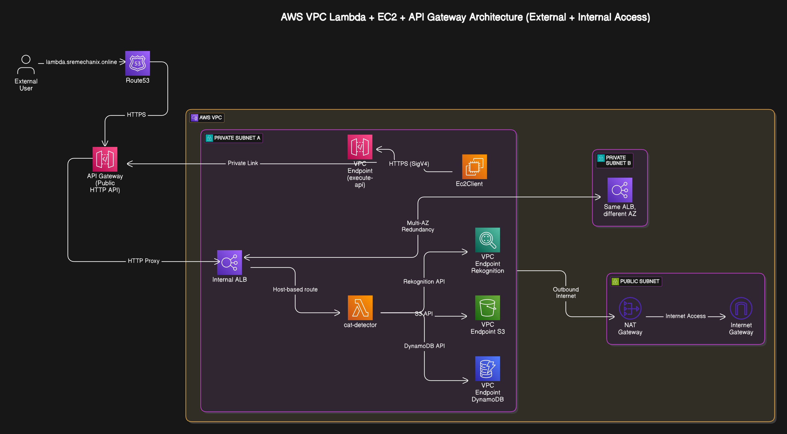

# Production infrastructure: Dual public and internal locked down setup

This production setup combines **API Gateway**, **Lambda**, **EC2**, **ALB**, and **VPC Endpoints** within a secure, cost-effective VPC design.

## Architecture Overview



Key components:
- Public HTTP API Gateway for external access
- Internal ALB (multi-AZ) routing to Lambda
- EC2 client operating fully within the VPC
- VPC Endpoints for S3, DynamoDB, Rekognition, and execute-api (API Gateway)

---

## Key Architectural Goals and Decisions

### 1. Use of HTTP API Instead of REST API

**Reason**: To reduce costs.

- HTTP API Gateway is significantly cheaper than REST API Gateway.
- Ideal for simple, proxy-based request routing if advanced features like request/response transformation are not required.

#### 💸 Cost Comparison by Monthly Request Volume

| Monthly Requests (M) | HTTP API Gateway ($) | REST API Gateway ($) | VPC Endpoints ($) | ALB ($) | Total HTTP API ($) | Total REST API ($) | Savings ($) |
|----------------------|----------------------|-----------------------|--------------------|---------|---------------------|----------------------|--------------|
| 1                    | 1.00                 | 3.50                  | 28.80              | 18.00   | 47.80               | 50.30                | 2.50         |
| 10                   | 10.00                | 35.00                 | 28.80              | 18.00   | 56.80               | 81.80                | 25.00        |
| 100                  | 100.00               | 350.00                | 28.80              | 18.00   | 146.80              | 396.80               | 250.00       |

> Notes:
> - VPC Endpoints assumed: `execute-api`, `s3`, `dynamodb`, `rekognition` (~$7.20 each).
> - ALB cost is estimated at $18/month based on modest usage.
> - Lambda costs are identical in both models and not shown here.

#### ✅ Why HTTP API Wins

- 70% lower API Gateway costs for the same request volume.
- Fully supports ALB and VPC endpoint routing.
- No advanced REST API features required for this service (e.g., request validation, caching).

#### 🔁 PrivateLink Usage (Applies to Both APIs)

| VPC Endpoint Type      | Purpose                                |
|------------------------|----------------------------------------|
| `execute-api`          | EC2-to-API Gateway (internal routing)  |
| `s3`                   | Private S3 access from Lambda/EC2      |
| `dynamodb`             | Secure access to DynamoDB              |
| `rekognition`          | Private image analysis API access      |

> **Conclusion**: HTTP API with ALB and PrivateLinks offers a secure, cost-efficient solution with the same internal capabilities as REST API, but with significantly lower operational cost at scale.

---

### 2. Ensure EC2 Client Traffic Never Leaves the VPC

- EC2 client can access the API Gateway via a **VPC Interface Endpoint (execute-api)**.
- Alternatively, the client can also interact directly with **Amazon S3** and **DynamoDB** via **VPC Interface Endpoints**.
- This ensures all traffic remains within AWS’s private network (via **PrivateLink**).

**Benefits**:
- Improved security (no traffic over the public internet)
- Lower latency and more consistent performance
- No need to manage public IPs or NAT configuration
- Compliance with data residency and privacy requirements
- **Direct uploads to S3** without exposing buckets to the public or routing through the internet
- **Direct reads/writes to DynamoDB** for fast, secure access to metadata or configuration
- Simplifies architecture by avoiding the need for Lambda intermediaries for basic storage or query operations
---

### 3. Use ALB for Public and Internal Access Control

- An internal **Application Load Balancer (ALB)** is placed in front of the Lambda function.
- Public HTTP API Gateway proxies to this ALB.

**Benefits**:
- Centralized request routing and traffic inspection
- Ability to enforce:
  - IP allowlists/deny rules
  - Authentication/authorization
  - WAF protection
- Supports host-based routing for future service expansion

---

### 4. Multi-AZ Redundancy via ALB

- The internal ALB spans **Private Subnet A and B**, each in a different Availability Zone.
- Ensures **high availability** of the service in case of AZ failure.

---

### 5. Use of VPC Endpoints for AWS Services

- Lambda needs to access:
  - **Amazon Rekognition** (image analysis)
  - **Amazon S3** (file storage)
  - **Amazon DynamoDB** (metadata store)
- These services are accessed via **VPC Interface Endpoints**, keeping all traffic private.

**Benefits**:
- No need for outbound internet access
- Lower data transfer costs
- Increased security and lower latency

---

### 6. Controlled Internet Access via NAT Gateway

- Lambda and EC2 instances can access the internet **only when needed** via:
  - Private Subnet → NAT Gateway → Internet Gateway

**Use Cases**:
- Software package downloads
- External telemetry or monitoring agents

---

### 7. DNS and Public Routing via Route53

- External users access the service via:
```
External User → Route53 → Public HTTP API Gateway → Internal ALB → Lambda
```

### 8. Internal Access to Lambda from EC2Client

The `EC2Client` can invoke the `cat-detector` Lambda function using two methods:

#### a. Via API Gateway (Private HTTP Access)

```
EC2Client → VPC Endpoint (execute-api) → API Gateway (HTTP API) → Internal ALB → Lambda
```

#### b. Via Direct Upload to S3 (Event-Driven Trigger)
```
EC2Client → VPC Endpoint (S3) → Amazon S3 (Upload) → S3 Event Trigger → Lambda
```
