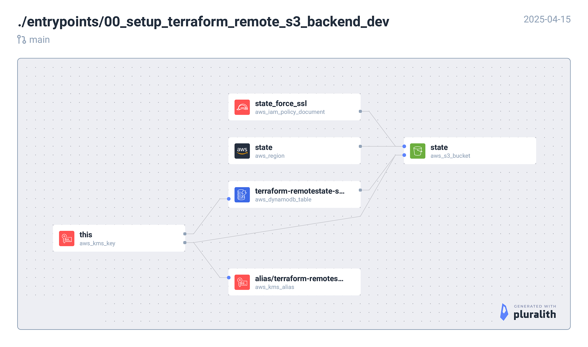

<!-- BEGIN_TF_DOCS -->
## Requirements

| Name | Version |
|------|---------|
|  [terraform](#requirement\_terraform) | = 1.11.3 |
|  [aws](#requirement\_aws) | ~> 5.94.0 |

## Providers

No providers.

## Modules

| Name | Source | Version |
|------|--------|---------|
|  [remote\_state](#module\_remote\_state) | nozaq/remote-state-s3-backend/aws | 1.6.1 |

## Resources

No resources.

## Inputs

| Name | Description | Type | Default | Required |
|------|-------------|------|---------|:--------:|
|  [env](#input\_env) | Deployment environment. e.g. dev, uat, prod | `string` | n/a | yes |
|  [region](#input\_region) | AWS region. e.g. eu-west-1 | `string` | n/a | yes |
|  [unique\_str](#input\_unique\_str) | A unique string to avoid conflicts | `string` | n/a | yes |

## Outputs

| Name | Description |
|------|-------------|
|  [dynamodb\_table](#output\_dynamodb\_table) | n/a |
|  [kms\_key](#output\_kms\_key) | n/a |
|  [kms\_key\_alias](#output\_kms\_key\_alias) | n/a |
|  [kms\_key\_replica](#output\_kms\_key\_replica) | n/a |
|  [replica\_bucket](#output\_replica\_bucket) | n/a |
|  [state\_bucket](#output\_state\_bucket) | n/a |
|  [terraform\_iam\_policy](#output\_terraform\_iam\_policy) | n/a |
<!-- END_TF_DOCS -->