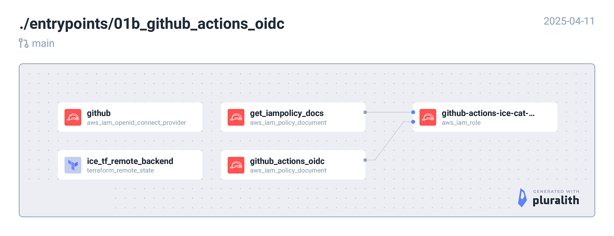

<!-- BEGIN_TF_DOCS -->
## Requirements

| Name | Version |
|------|---------|
|  [terraform](#requirement\_terraform) | = 1.11.3 |
|  [aws](#requirement\_aws) | ~> 5.94.0 |

## Providers

| Name | Version |
|------|---------|
|  [aws](#provider\_aws) | 5.94.1 |

## Modules

No modules.

## Resources

| Name | Type |
|------|------|
| [aws_iam_openid_connect_provider.github](https://registry.terraform.io/providers/hashicorp/aws/latest/docs/resources/iam_openid_connect_provider) | resource |
| [aws_iam_policy.get_iampolicies](https://registry.terraform.io/providers/hashicorp/aws/latest/docs/resources/iam_policy) | resource |
| [aws_iam_role.github_action_role](https://registry.terraform.io/providers/hashicorp/aws/latest/docs/resources/iam_role) | resource |
| [aws_iam_role_policy_attachment.this](https://registry.terraform.io/providers/hashicorp/aws/latest/docs/resources/iam_role_policy_attachment) | resource |
| [aws_iam_policy_document.get_iampolicy_docs](https://registry.terraform.io/providers/hashicorp/aws/latest/docs/data-sources/iam_policy_document) | data source |
| [aws_iam_policy_document.github_actions_oidc](https://registry.terraform.io/providers/hashicorp/aws/latest/docs/data-sources/iam_policy_document) | data source |

## Inputs

| Name | Description | Type | Default | Required |
|------|-------------|------|---------|:--------:|
|  [aws\_acc\_no](#input\_aws\_acc\_no) | AWS account number | `string` | n/a | yes |
|  [created\_by](#input\_created\_by) | Created by | `string` | `"terraform"` | no |
|  [env](#input\_env) | Deployment environment. e.g. dev, uat, prod | `string` | n/a | yes |
|  [owner](#input\_owner) | Owner of the project | `string` | `"DevOps"` | no |
|  [project](#input\_project) | Project name | `string` | `"stablecaps"` | no |
|  [region](#input\_region) | AWS region. e.g. eu-west-1 | `string` | n/a | yes |
|  [unique\_str](#input\_unique\_str) | A unique string to avoid conflicts | `string` | n/a | yes |

## Outputs

| Name | Description |
|------|-------------|
|  [gha\_oidc\_provider\_arn](#output\_gha\_oidc\_provider\_arn) | Github Actions OIDC Connect Provider ARN |
|  [iam\_role\_arn](#output\_iam\_role\_arn) | IAM Role ARN for Github Actions OIDC |
<!-- END_TF_DOCS -->
