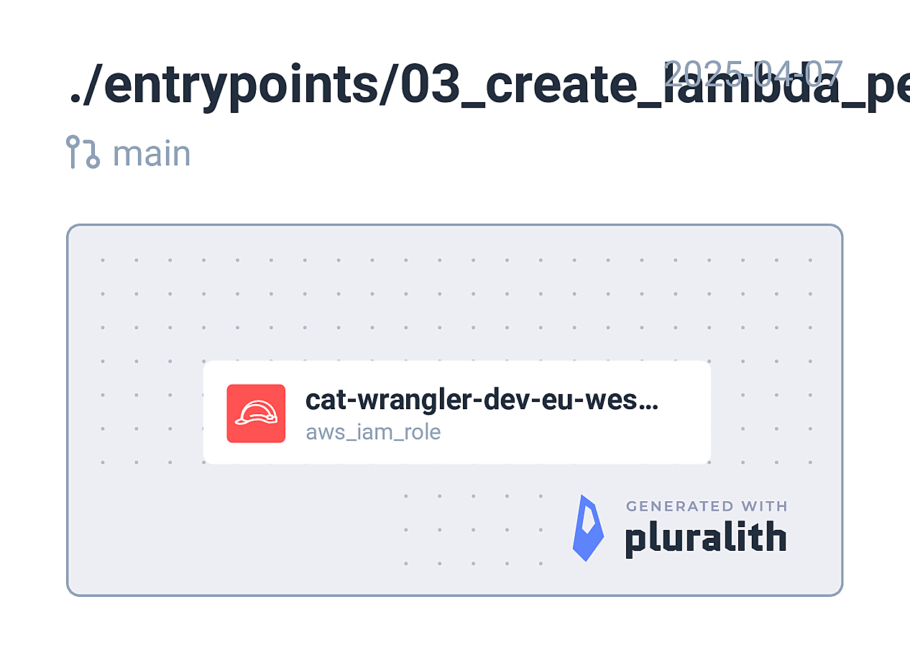

<!-- BEGIN_TF_DOCS -->
## Requirements

| Name | Version |
|------|---------|
|  [terraform](#requirement\_terraform) | = 1.11.3 |
|  [aws](#requirement\_aws) | ~> 5.94.0 |

## Providers

No providers.

## Modules

| Name | Source | Version |
|------|--------|---------|
|  [lambda\_role\_and\_policies](#module\_lambda\_role\_and\_policies) | github.com/stablecaps/terraform-aws-iam-policies-stablecaps | v2.0.0 |

## Resources

No resources.

## Inputs

| Name | Description | Type | Default | Required |
|------|-------------|------|---------|:--------:|
|  [created\_by](#input\_created\_by) | Created by | `string` | `"terraform"` | no |
|  [env](#input\_env) | Deployment environment. e.g. dev, uat, prod | `string` | n/a | yes |
|  [owner](#input\_owner) | Owner of the project | `string` | `"DevOps"` | no |
|  [project](#input\_project) | Project name | `string` | `"cat-wrangler"` | no |
|  [region](#input\_region) | AWS region. e.g. eu-west-1 | `string` | n/a | yes |
|  [unique\_str](#input\_unique\_str) | A unique string to avoid conflicts | `string` | n/a | yes |

## Outputs

No outputs.
<!-- END_TF_DOCS -->
