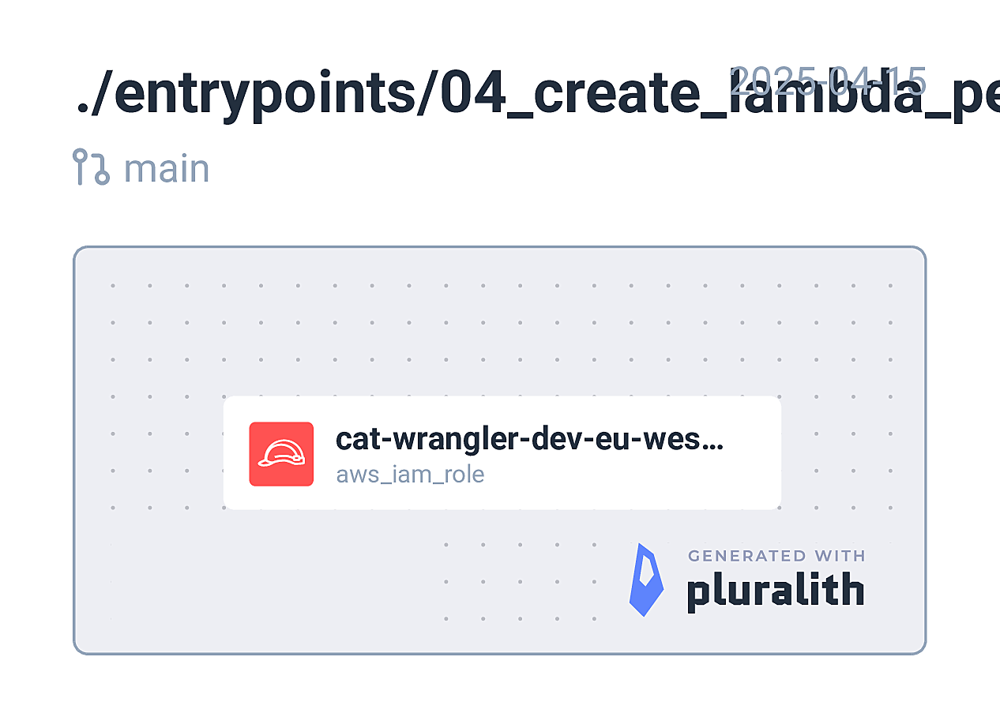

<!-- BEGIN_TF_DOCS -->
## Requirements

| Name | Version |
|------|---------|
|  [terraform](#requirement\_terraform) | = 1.11.3 |
|  [aws](#requirement\_aws) | ~> 5.94.0 |

## Providers

| Name | Version |
|------|---------|
|  [aws](#provider\_aws) | 5.94.1 |

## Modules

| Name | Source | Version |
|------|--------|---------|
|  [lambda\_role\_and\_policies](#module\_lambda\_role\_and\_policies) | github.com/stablecaps/terraform-aws-iam-policies-stablecaps | v2.1.0 |

## Resources

| Name | Type |
|------|------|
| [aws_ssm_parameter.lambda_role_cat_arn](https://registry.terraform.io/providers/hashicorp/aws/latest/docs/resources/ssm_parameter) | resource |

## Inputs

| Name | Description | Type | Default | Required |
|------|-------------|------|---------|:--------:|
|  [aws\_acc\_no](#input\_aws\_acc\_no) | AWS account number | `string` | n/a | yes |
|  [company](#input\_company) | Project name | `string` | `"stablecaps"` | no |
|  [created\_by](#input\_created\_by) | Created by | `string` | `"terraform"` | no |
|  [env](#input\_env) | Deployment environment. e.g. dev, uat, prod | `string` | n/a | yes |
|  [owner](#input\_owner) | Owner of the project | `string` | `"DevOps"` | no |
|  [project](#input\_project) | Project name | `string` | `"cat-wrangler"` | no |
|  [region](#input\_region) | AWS region. e.g. eu-west-1 | `string` | n/a | yes |
|  [s3bucket\_dest\_name](#input\_s3bucket\_dest\_name) | s3 bucket destination name. Stores successfully processed images are stored | `string` | n/a | yes |
|  [s3bucket\_fail\_name](#input\_s3bucket\_fail\_name) | s3 bucket fail name. Stores data from failed image processing | `string` | n/a | yes |
|  [s3bucket\_source\_name](#input\_s3bucket\_source\_name) | s3 bucket source name. Stores images to be processed | `string` | n/a | yes |
|  [unique\_str](#input\_unique\_str) | A unique string to avoid conflicts | `string` | n/a | yes |

## Outputs

| Name | Description |
|------|-------------|
|  [iam\_role\_arn](#output\_iam\_role\_arn) | Lambda IAM role arn used for serverless function |
<!-- END_TF_DOCS -->
